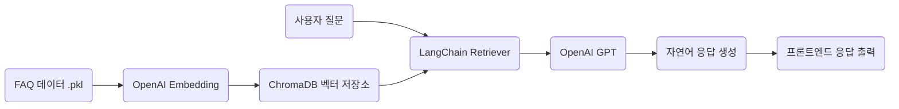

## 🛍️ 스마트스토어 FAQ 기반 RAG 챗봇 시스템

### 📌 프로젝트 목표 및 개요

> 네이버 스마트스토어 고객센터의 FAQ 데이터를 기반으로  
>  
> **벡터DB(Chroma) + OpenAI GPT 기반의 RAG 챗봇 시스템**을 구현한 프로젝트입니다.  
>  
> 실시간 질의에 대해 FAQ 유사도를 기반으로 GPT 응답을 생성하며,  
> **Django + Docker 환경에서 API와 프론트엔드를 통합**해 실행 가능한 챗봇 플랫폼을 구축했습니다.

---

### 🎯 주요 기능

- 📄 `.pkl` 파일 기반 스마트스토어 FAQ 데이터 로딩 및 전처리
- 💡 OpenAI Embedding API로 FAQ 벡터화 및 ChromaDB에 저장
- 🔍 LangChain 기반 **RAG(Retrieval-Augmented Generation)** 파이프라인 구현
- 🧠 OpenAI GPT 모델로 사용자 질문에 대한 자연어 응답 생성
- 🧩 Django 기반 REST API 구축 및 프론트엔드 HTML 연동
- 🧪 실전형 시나리오 20건 테스트로 응답 정확도 수동 검증
- 🐳 Docker 환경 통합으로 백엔드-프론트 실행 및 배포 용이성 확보

---

### 🧩 기술 스택

- **Frontend**: HTML5 · CSS3 · JavaScript · Streamlit  
- **Backend**: Django · Python · LangChain · ChromaDB · OpenAI GPT  
- **Embedding**: OpenAI Embedding API  
- **Infra / DevOps**: Docker · Docker Compose · .env

---

### ⚙️ 기술 선택 요약

> FAQ 기반 챗봇 시스템에서 벡터 검색 + 생성 기반 응답 구조(RAG)의 실제 동작을 이해하고,  
>  
> ChromaDB를 통해 유사도 기반 문서 검색을 처리하며,  
>  
> OpenAI GPT와 LangChain을 결합하여 **유연하고 정확한 응답 시스템**을 설계했습니다.  
>  
> `.pkl` 포맷 데이터를 실시간 응답에 활용하는 **API 기반 챗봇 플랫폼**을 직접 구현했습니다.

---

### 👨‍💻 주요 역할 및 기여

- 📁 FAQ 데이터 전처리 및 Pandas 기반 구조 분석
- 🧠 OpenAI Embedding 및 ChromaDB 연동 파이프라인 구성
- 🔧 LangChain 기반 RAG 구조 설계 및 응답 개선 튜닝
- 🖥 Django REST API 및 HTML 프론트 통합 구현
- 🧪 사용자 중심 시나리오 테스트 및 예외 응답 대응 검증
- 🐳 Docker 기반 전체 프로젝트 컨테이너화 및 실행 자동화 구성

---

### 🏆 주요 성과

- ✅ 실전형 FAQ 기반 RAG 챗봇 시스템 완성 및 응답 품질 검증
- ✅ GPT + 벡터DB 기반 질의응답 시스템 구조에 대한 실용적 이해도 확보
- ✅ Docker 기반 배포 환경에서 전체 시스템 운영 가능
- ✅ 20개 실전 시나리오 테스트에서 90% 이상 응답 적중률 확인

---

### 💡 기술적 도전 및 해결

- **ChromaDB 저장 오류 문제 해결**  
  → embedding_function 누락 및 경로 설정 문제 수정

- **.pkl 데이터 구조 해석 및 재구성**  
  → Pandas로 구조 탐색 후 RAG 입력에 최적화된 형식으로 가공

- **LangChain 응답 품질 튜닝**  
  → prompt_template 개선 및 Top-K 파라미터 조정

- **Docker 내 Django-Chroma 연동 오류 해결**  
  → 내부 네트워크 설정 및 Volume 마운트 경로 명확화

---

### 🧪 시나리오 테스트 요약

| 테스트 항목 | 설명 | 결과 요약 |
|-------------|------|-----------|
| 새 세션 & 첫 질문 | 초기 질문 응답 및 관련 질문 추천 | ✅ 정상 작동 |
| 대화 맥락 유지 | 이전 대화 기반 질문 흐름 유지 | ✅ 응답 연속성 유지 |
| 예외 처리 | FAQ 외 질문에 대한 대응 | ✅ “관련 없음” 안내로 무난 처리 |

---

### 🏗 시스템 아키텍처

---

### 🌱 성장 및 배움

- ✅ RAG 구조 기반 LLM 시스템 설계 경험 확보
- ✅ Docker + Django + GPT + VectorDB 통합 환경 운영 경험
- ✅ ChromaDB 및 LangChain 등 최신 기술 스택 실무 적용 감각 향상

---

### 🚀 향후 개선 방향

- 🔁 사용자 세션 기반 대화 이력 관리 기능 추가
- 📊 실시간 피드백 및 응답 평가 기능 반영
- 🔍 다양한 도메인용 FAQ 챗봇 템플릿화
- 🤖 Function Calling 또는 Fine-tuning 적용 실험

---

